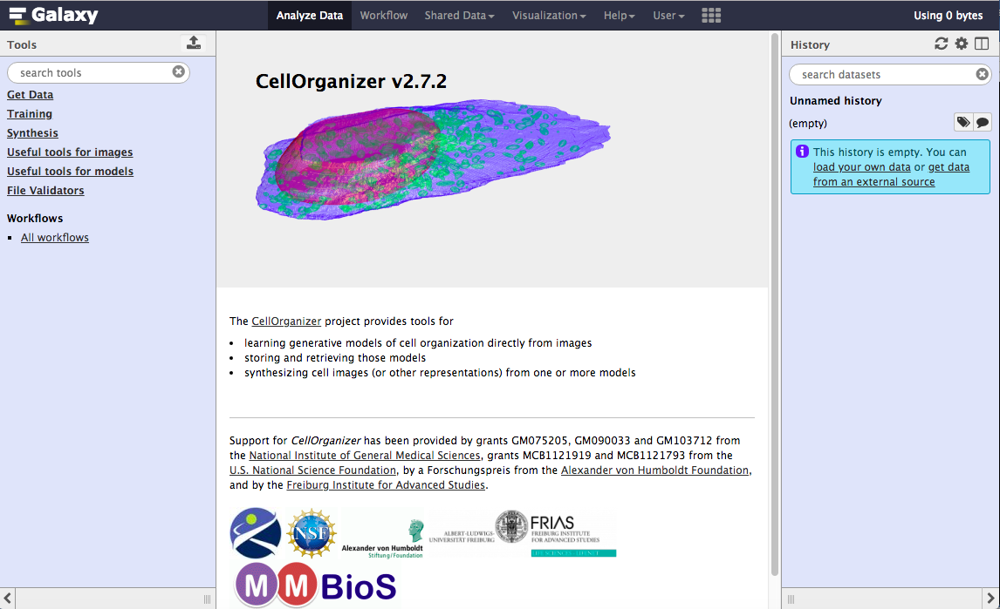

CellOrganizer on Galaxy+Bridges
===============================

Introduction
************
CellOrganizer is an open source system for using cellular microscope images to learn statistical models of the structure of cell components and of how those components are organized relative to each other. These generative models may then be used to synthesize new images in order to reflect what the model has learned. The model learning component of CellOrganizer allows for the user to capture variation amongst cells in a collection of images.

Essentially, CellOrganizer provides the tools for

* Learning generative models of cell organization directly from microscope images

* Storing and retrieving those generative models in XML files

* Synthesizing cell images (or other representations) from one or more models

For the duration of this tutorial, the user will be working with CellOrganizer on Galaxy+Bridges for training and synthesis from two- and three- dimensional models.

Galaxy is an open, web-based platform intended for data intensive biomedical research. This instance of Galaxy will seamlessly allow the user to create and implement workflows on CellOrganizer to create and analyze parametric and non-parametric models as well as their respective samples.

Galaxy Registration
*******************

In order to use CellOrganizer on Galaxy+Bridges, the user must have a registered account.

.. image:: ../images/registerbutton.png

#. Open a web browser, and go on to the `Galaxy+Bridges <http://galaxy2.bridges.psc.edu:8080>`_ site.
#. Hover over User on the top navigation toolbar and choose Register from the dropdown menu.
#. Fill out the registration form by entering an email address, password, and public name (optional), for your account and hit Submit.

You should now be registered onto Galaxy, logged in, and redirected to the home interface.

Galaxy Home Interface
*********************

Please make sure you are logged in before proceeding in this section by hovering over User on the top navigation toolbar and seeing your login name as the first item on the dropdown menu. If you are not logged in, choose Login from the User dropdown menu and login using your account information.

The Galaxy interface is divided into four parts: the top navigation bar (top of the page), the Tools window (left side of the page), the History window (right side of the page), and the Main Content window (center of the page).

The Tools window allows the user to choose which job they are interested in scheduling. For this tutorial, the options are divided into four categories: Demos, Synthesizing, Training, and Useful Tools. These four categories, and their components are further explained in the next section, Galaxy+Bridges Tools and Its Options.

The History window depicts the user’s personal scheduler along with their current status through color coding. When a job is submitted to the queue (Galaxy Tasks, Create a Job), it appears at the top of the History window in the form of a small rectangle with a designated number and a descriptive name. The color of the box correlates with the current status of the job, with

* a grey background meaning that the job has been submitted, but has not been accepted,
* a yellow background meaning that the job has been accepted by the queue, and
* a green background meaning that the job is complete and is ready to be viewed.

The Main Content window is Galaxy+Bridges’ workspace. Once a job or workflow is chosen from the Tool Shed, any direct interaction with CellOrganizer occurs in the Main Content window. Sample interactions can be found in the Galaxy Tasks section.

Galaxy+Bridges Tools and Its Options
************************************

Demos are image-based widgets with an output of tiff files that can be used in conjunction with a tool. For this tutorial, the user’s demo options are a two – dimensional (2D) diffeomorphic model and a three – dimensional classic model.

In CellOrganizer, there are two prominent treatment of images, Training and Synthesizing.

Useful tools are assessments that the user can run on the trained models and/or synthesized images.

Galaxy Tasks
************

In Galaxy+Bridges, there are two types of jobs that can be scheduler for computation and/or compilation: a simple job and a workflow. A simple job refers to a one – component task that asks for direct results from an input. A workflow on the other hand, allows for multiple, dependent components to enter the queue as designed by the user. The how-to’s for creating a simple job versus a workflow follow:

Create a Job
------------
#. Choose and click on the desired task from the Tools window.
#. In the Main Content window, choose the input parameters required for the task.
#. Click on Execute in order to send the task to the queue.

Create a Workflow
-----------------

#. In the top navigation bar, click on the Workflow tab.
#. Click on the Create New Workflow button in the top right corner.
#. Click on the Create button after naming and annotating (describing) the workflow.
#. In the Tools window, click on Inputs → Input dataset, which pops up as small box in the workspace.
#. Click on the useful tools you wish to link together in the workflow and make sure that all boxes appear onto the Main Content window.
#. Arrange the boxes in the order/organization desired within the workspace.
#. Connect the input dataset box, which represents all of the initial inputs of the workflow, to the next task in the workflow by clicking on the input dataset box arrow, and holding while dragging the cursor to the next box’s input arrow.
#. Continue to connect all boxes in the workflow in a similar manner.
#. Click on the small gear at the top of the workspace, and Save your workflow.
#. Click on the gear again to Run the workflow.
#. Choose the appropriate inputs for the workflow and Submit to the queue.

Sample CellOrganizer Workflows
******************************

Below are some sample CellOrganizer workflows that can be created by the user on Galaxy+Bridges with the current demos and tools. These four samples are

* Train and show space shape from a 2D diffeomorphic framework model
* Train and visualize the shape space from a 2D diffeomorphic model
* Train and synthesize from a 3D vesicular model
* Compare two 3D vesicular models

